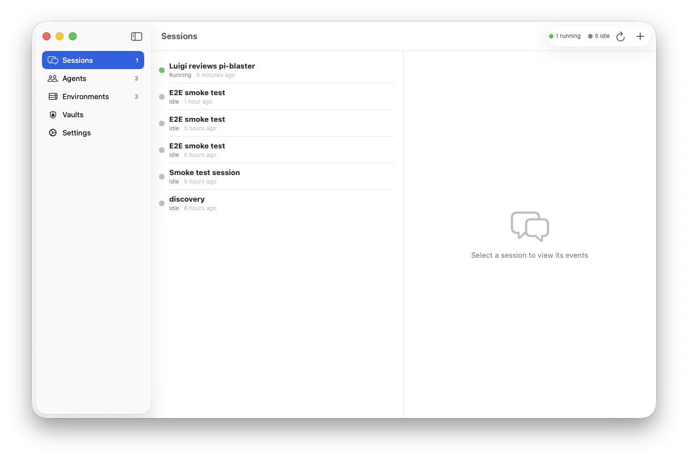
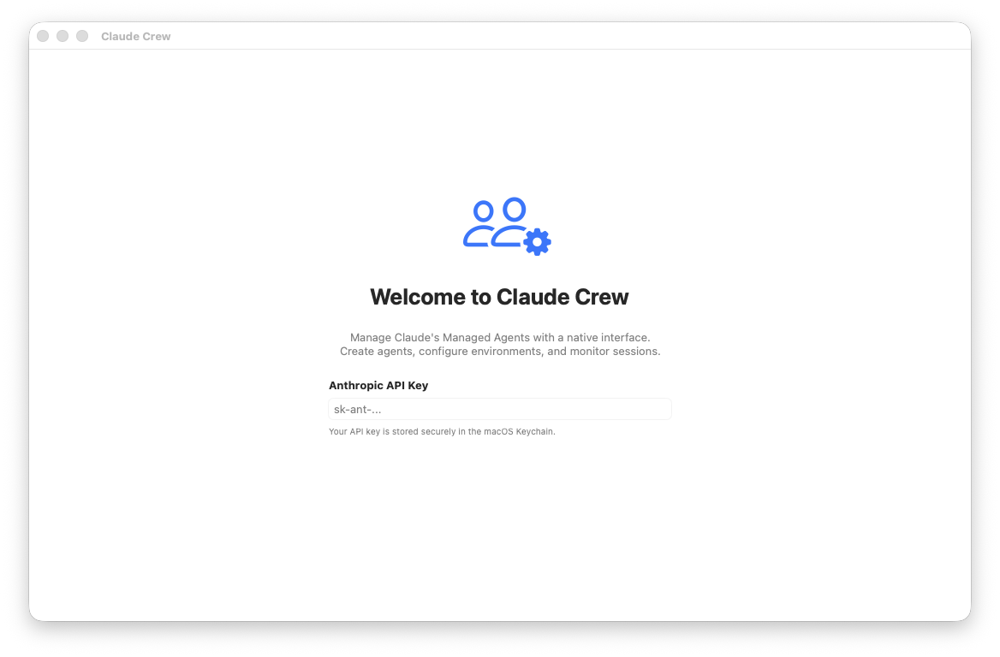

# Claude Crew

A native macOS app for managing [Claude Managed Agents](https://platform.claude.com/docs/en/managed-agents/quickstart).

Create agents, configure environments, start sessions, and watch them work — all from a native SwiftUI interface.



## Features

- **Agents** — Create and configure agents with model selection (Opus/Sonnet/Haiku), system prompts, per-tool toggles, and MCP server connections
- **Environments** — Define cloud container templates with package management (pip, npm, apt, cargo, gem, go) and networking controls (unrestricted or allowlisted)
- **Sessions** — Start agent sessions, stream events via SSE in real-time, send messages, and interrupt running agents
- **Vaults** — Manage per-user authentication credentials for MCP servers (OAuth and static bearer tokens)
- **Status Bar** — See at a glance how many agents are running or idle
- **Secure** — API key stored in macOS Keychain, with `ANTHROPIC_API_KEY` env var override for development



## Requirements

- macOS 14.0+
- Xcode 16.0+
- An [Anthropic API key](https://console.anthropic.com/settings/keys) with Managed Agents beta access

## Getting Started

```bash
# Install XcodeGen (one-time)
brew install xcodegen

# Clone and build
git clone <repo-url>
cd claude-crew
xcodegen generate
open ClaudeCrew.xcodeproj
# Cmd+R to build and run
```

To skip Keychain prompts during development, set the environment variable:
```bash
export ANTHROPIC_API_KEY="sk-ant-..."
```

## Running Tests

Tests read the API key from `~/.claude-crew-test-key` (to avoid Keychain prompts on each build):

```bash
echo "sk-ant-your-key" > ~/.claude-crew-test-key
chmod 600 ~/.claude-crew-test-key

xcodegen generate
xcodebuild -project ClaudeCrew.xcodeproj -scheme ClaudeCrewTests \
  -destination "platform=macOS" test
```

**25 tests total:**
- 18 model decoding tests (agents, environments, sessions, vaults, credentials, events)
- 7 live API smoke tests (list resources, full create/message/cleanup flow, error handling)

### E2E Test

A standalone bash script exercises the full agent lifecycle:

```bash
export ANTHROPIC_API_KEY="sk-ant-..."
bash e2e-test.sh
```

Creates an agent, environment, and session, sends a task, streams events, verifies the agent completed, then cleans up.

## Demo: Luigi the Linux Plumber

The `demo-luigi.sh` script showcases the full power of managed agents. It creates "Luigi the Linux Plumber" — a Sonnet-powered agent that:

1. Clones [pi-blaster](https://github.com/sarfata/pi-blaster/)
2. Reads the codebase and README
3. Fetches all open GitHub issues
4. Picks one it can fix (chose [#66 — "Support GPIO pins above 31"](https://github.com/sarfata/pi-blaster/issues/66))
5. Implements the fix

Luigi's analysis:

> **Issue #66 — "Support GPIO pins above 31"** — It's the repo owner's own bug report,
> a clear C code bug, and it affects multiple downstream issues. `gpio_set()` uses
> `1 << pin` which is undefined behaviour in C for `pin >= 32`. Also always writes to
> `GPIO_SET0`/`GPIO_CLR0` (pins 0–31 only). The fix adds a second GPIO bank for
> pins 32–53.

## API Coverage

Claude Crew wraps the Managed Agents API (`managed-agents-2026-04-01` beta):

| Resource | Create | List | Get | Update | Archive | Delete | Stream |
|----------|--------|------|-----|--------|---------|--------|--------|
| Agents | Yes | Yes | Yes | Yes | Yes | — | — |
| Environments | Yes | Yes | Yes | — | Yes | Yes | — |
| Sessions | Yes | Yes | Yes | — | Yes | Yes | SSE |
| Vaults | Yes | Yes | — | — | Yes | Yes | — |
| Credentials | Yes | Yes | — | — | Yes | — | — |
| Events | Send | — | — | — | — | — | SSE |

> **Note:** The stream endpoint currently requires the `agent-api-2026-03-01` beta header
> while CRUD endpoints use `managed-agents-2026-04-01`. The app handles this automatically.

## Architecture

```
ClaudeCrew/
├── App/                  # @main entry point
├── API/
│   ├── AnthropicClient   # actor, async/await, SSE streaming
│   └── KeychainHelper    # macOS Keychain storage
├── Models/               # Codable types matching the API
│   ├── Agent             # tools, MCP, versioning
│   ├── Environment       # packages, networking
│   ├── Session           # status, lifecycle
│   ├── Vault             # credentials, OAuth
│   └── Event             # SSE event types (both API versions)
├── ViewModels/
│   ├── AppState          # @Observable, centralized state
│   └── SessionViewModel  # per-session event streaming
└── Views/
    ├── Agents/           # list, detail, create
    ├── Environments/     # list, detail, create (with didactic guidance)
    ├── Sessions/         # list, detail with full event log, message input
    ├── Vaults/           # list, detail, create, add credentials
    └── Settings/         # API key management
```

**Key design decisions:**
- `AnthropicClient` is a Swift actor for safe concurrent access
- SSE streaming uses `URLSession.bytes` wrapped in `AsyncThrowingStream`
- `@Observable` (Swift Observation) for reactive UI — no Combine
- Zero external dependencies
- Both API event formats handled (`agent.tool_use` and `agent_tool_use`)

## License

MIT
