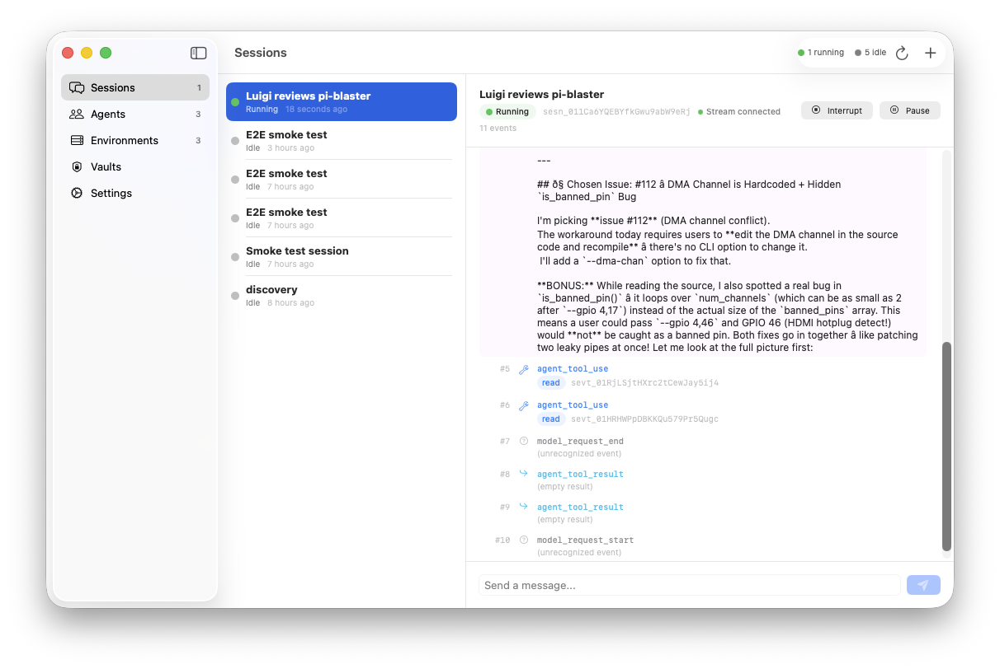
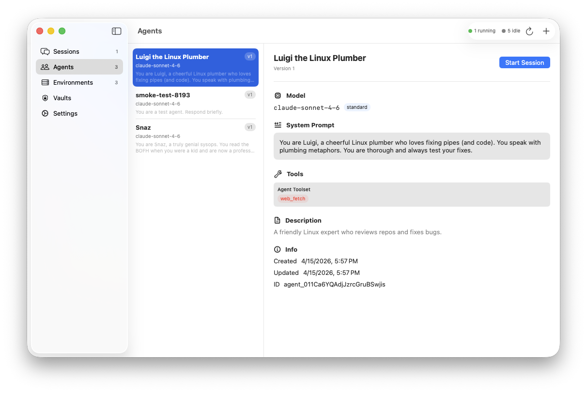
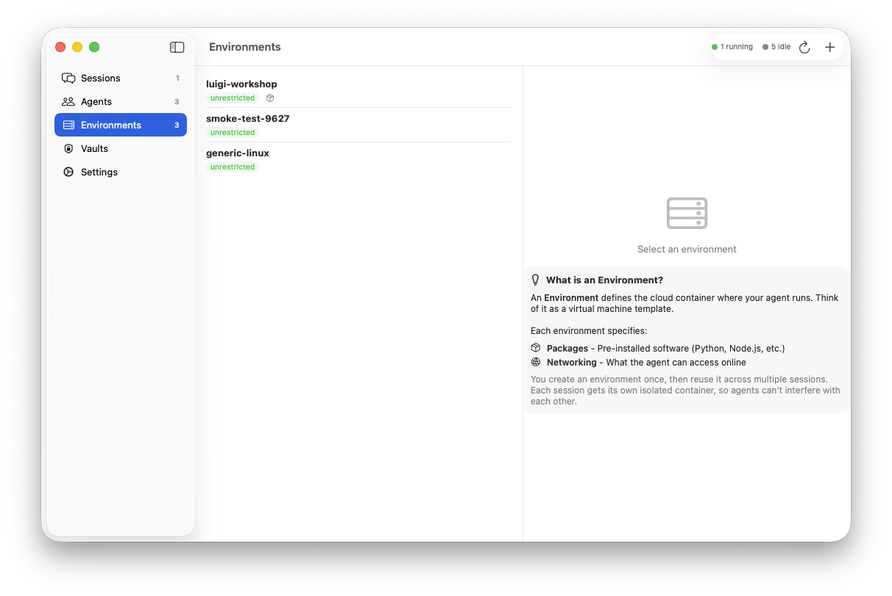

# Claude Crew

A native macOS app for managing [Claude Managed Agents](https://platform.claude.com/docs/en/managed-agents/quickstart). Create agents, configure environments, start sessions, and watch them work — all from a native SwiftUI interface.

<video src="https://github.com/sarfata/claude-crew/raw/main/demo.mp4" autoplay loop muted playsinline width="100%"></video>

<sub>Scout reviews pi-blaster: sessions list → session events → agent config (4x speed)</sub>

<details>
<summary>Screenshots</summary>

<table>
<tr>
<td width="50%">

<p align="center"><b>Sessions</b> — live status, running/idle badges</p>
</td>
<td width="50%">

<p align="center"><b>Event Stream</b> — real-time SSE events from the agent</p>
</td>
</tr>
<tr>
<td width="50%">

<p align="center"><b>Agent Config</b> — model, prompt, tools, MCP servers</p>
</td>
<td width="50%">

<p align="center"><b>Environments</b> — container config with inline guidance</p>
</td>
</tr>
</table>

</details>

## Features

- **Agents** — Create and configure agents with model selection (Opus/Sonnet/Haiku), system prompts, per-tool toggles, and MCP server connections
- **Environments** — Define cloud container templates with package management (pip, npm, apt, cargo, gem, go) and networking controls
- **Sessions** — Start sessions, stream events via SSE in real-time, send messages, interrupt running agents
- **Vaults** — Manage per-user credentials for MCP servers (OAuth and static bearer tokens)
- **Status Bar** — Running/idle session counts at a glance
- **Secure** — API key in macOS Keychain, `ANTHROPIC_API_KEY` env var override for development

## Getting Started

```bash
brew install xcodegen
git clone <repo>
cd claude-crew
xcodegen generate
open ClaudeCrew.xcodeproj  # Cmd+R
```

Skip Keychain prompts during development:
```bash
export ANTHROPIC_API_KEY="sk-ant-..."
```

## Tests

```bash
# Write API key for tests (avoids Keychain prompts)
echo "sk-ant-..." > ~/.claude-crew-test-key && chmod 600 ~/.claude-crew-test-key

xcodegen generate
xcodebuild -scheme ClaudeCrewTests -destination "platform=macOS" test
```

**25 tests** — 18 model decoding + 7 live API smoke tests (full create/message/cleanup flow).

E2E test via bash:
```bash
export ANTHROPIC_API_KEY="sk-ant-..."
bash e2e-test.sh
```

## API Coverage

| Resource | Create | List | Get | Update | Archive | Delete | Stream |
|----------|--------|------|-----|--------|---------|--------|--------|
| Agents | yes | yes | yes | yes | yes | — | — |
| Environments | yes | yes | yes | — | yes | yes | — |
| Sessions | yes | yes | yes | — | yes | yes | SSE |
| Vaults | yes | yes | — | — | yes | yes | — |
| Credentials | yes | yes | — | — | yes | — | — |
| Events | send | — | — | — | — | — | SSE |

> The stream endpoint uses `agent-api-2026-03-01` while CRUD uses `managed-agents-2026-04-01`. The app handles this automatically.

## Architecture

```
ClaudeCrew/
├── App/                    @main entry point
├── API/
│   ├── AnthropicClient     actor, async/await, SSE streaming
│   └── KeychainHelper      macOS Keychain storage
├── Models/                 Codable types matching the API
│   ├── Agent               tools, MCP, versioning
│   ├── Environment         packages, networking
│   ├── Session             status, lifecycle
│   ├── Vault               credentials, OAuth
│   └── Event               SSE event types (both API versions)
├── ViewModels/
│   ├── AppState            @Observable, centralized state
│   └── SessionViewModel    per-session event streaming
└── Views/
    ├── Agents/             list, detail, create
    ├── Environments/       list, detail, create
    ├── Sessions/           list, detail, event log, message input
    ├── Vaults/             list, detail, create, add credentials
    └── Settings/           API key management
```

Zero external dependencies. Swift 6 strict concurrency. `AnthropicClient` is an actor with `URLSession.bytes` SSE streaming wrapped in `AsyncThrowingStream`.

## License

MIT
